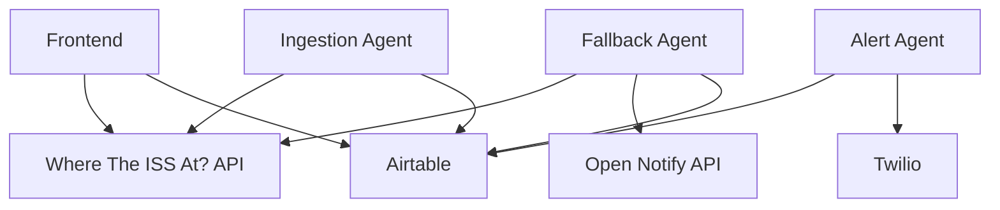

# RWM ISS Tracker

A real-time International Space Station (ISS) tracker web application that displays the ISS location and footprint on a map, stores data in Airtable, and sends notifications when the ISS is near your location.

## Features

- Real-time ISS tracking with OpenStreetMap visualization
- ISS footprint display with customizable radius
- SMS notifications via Twilio when ISS is nearby
- Historical position data stored in Airtable
- Responsive design for mobile devices
- Fallback mechanisms for API failures

## Tech Stack

### Frontend
- React with TypeScript
- Leaflet for map visualization
- Tailwind CSS for styling
- Axios for API calls

### Backend
- Python 3.13 with Microsoft AutoGen
- Airtable for data storage
- Twilio for SMS notifications
- Haversine for distance calculations

## Architecture



## Setup

1. Clone the repository:
   ```bash
   git clone https://github.com/yourusername/rwm_isstracker.git
   cd rwm_isstracker
   ```

2. Install frontend dependencies:
   ```bash
   npm install
   ```

3. Install Python dependencies:
   ```bash
   pip install -r requirements.txt
   ```

4. Configure environment variables:
   ```bash
   cp .env.example .env
   # Edit .env with your API keys and configuration
   ```

5. Initialize Airtable:
   - Create a new base in Airtable
   - Import the schema from `airtable_schema.json`
   - Update `AIRTABLE_BASE_ID` in `.env`

6. Start the development servers:
   ```bash
   # Terminal 1: Frontend
   npm start
   
   # Terminal 2: Backend
   python backend/agents/ingestion_agent.py
   python backend/agents/alert_agent.py
   python backend/agents/fallback_agent.py
   ```

## Testing

Run the test suite:
```bash
# Frontend tests
npm test

# Backend tests
pytest backend/tests/
```

## Deployment

The application is configured for automatic deployment to Vercel:

1. Push to the `main` branch
2. GitHub Actions will run tests
3. If tests pass, the application will be deployed to Vercel

## API Documentation

### Where The ISS At? API
- Endpoint: `https://api.wheretheiss.at/v1/satellites/25544`
- Provides: latitude, longitude, altitude, timestamp, footprint radius

### Open Notify API (Fallback)
- Endpoint: `http://api.open-notify.org/iss-now.json`
- Provides: latitude, longitude, timestamp

## Contributing

1. Fork the repository
2. Create a feature branch
3. Commit your changes
4. Push to the branch
5. Create a Pull Request

## License

MIT License - see LICENSE file for details 